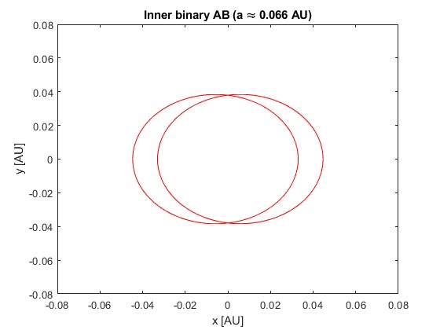
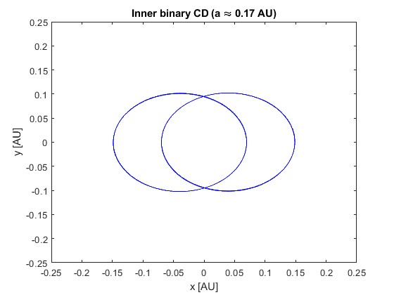
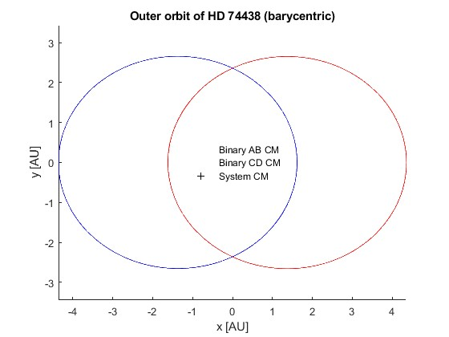
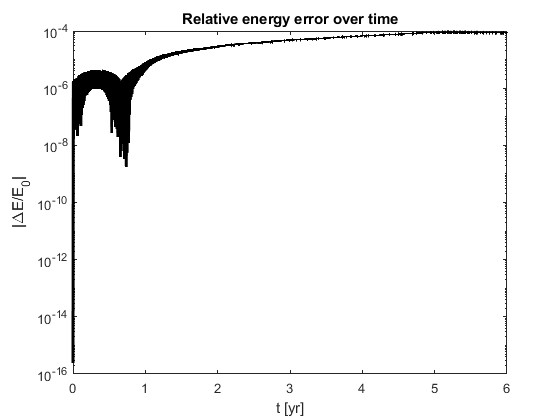
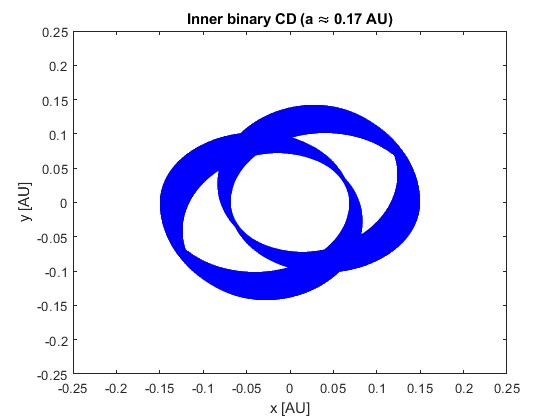

# Dual Binary N-Body Simulation

A MATLAB numerical simulation of the **HD 74438 2+2 quadruple star system**, modelling two interacting binary pairs using Newtonian gravitational dynamics, ODE integration, barycentric coordinates, orbital visualisation, and energy-conservation diagnostics.

This project was completed as part of a Financial Mathematics final-year dynamical systems project and has been cleaned for public portfolio use.

## Project Overview

HD 74438 is a hierarchical quadruple star system made up of two close binary pairs, AB and CD, which orbit each other. Because all four bodies interact gravitationally, the system provides a useful case study in orbital stability, secular dynamics, and chaotic behaviour.

The project simulates the system as a Newtonian four-body problem and explores whether the observed orbital structure can be reproduced numerically.

## Objectives

- Model HD 74438 as a four-body gravitational system.
- Generate initial conditions for two inner binaries and their wider outer orbit.
- Integrate the equations of motion using MATLAB ODE solvers.
- Validate simulated orbits against known semi-major axes, eccentricities, and orbital periods.
- Visualise inner binary motion, barycentric outer orbits, long-term rosette patterns, and homoclinic-like encounters.
- Monitor numerical reliability using relative energy-error diagnostics.

## Mathematical Model

The simulation treats each star as a point mass and integrates the Newtonian N-body equations:

```math
\ddot{\mathbf r}_i =
-G \sum_{j \ne i} m_j
\frac{\mathbf r_i - \mathbf r_j}{|\mathbf r_i - \mathbf r_j|^3},
\quad i = 1,\dots,4
```

## Repository Structure

```text
dual-binary-nbody-simulation/
├── src/
│   ├── hd74438_setup.m
│   ├── thesis.m
│   ├── thesis2.m
│   ├── Thesis3.m
│   └── rewrite.m
├── outputs/
│   ├── baseline-orbits/
│   ├── long-term-dynamics/
│   ├── chaos-diagnostics/
│   └── exploratory/
├── report/
│   └── dual_binary_systems_report.pdf
├── docs/
├── README.md
├── .gitignore
└── LICENSE
```

## Key Results

### Baseline Orbit Validation

The model reproduces the main orbital structure of HD 74438:

- Inner binary AB: semi-major axis approximately 0.066 AU
- Inner binary CD: semi-major axis approximately 0.17 AU
- Outer AB-CD orbit: semi-major axis approximately 5.2 AU

The baseline plots show the inner binary ellipses and the wider barycentric orbit of the two binary centres of mass.

### Long-Term Dynamics

Longer integrations show rosette-like orbital patterns caused by apsidal precession. These plots highlight how small perturbations from the companion binary accumulate over time.

### Chaos Diagnostics

The project includes homoclinic-like encounter visualisations and energy-error diagnostics. These were used to explore the transition between regular and chaotic behaviour in the four-body system.

## Example Outputs

### Inner Binary AB



### Inner Binary CD



### Outer Barycentric Orbit



### Energy Conservation



### Long-Term CD Rosette



### Homoclinic-Like Encounter


## Skills Demonstrated

- MATLAB scientific computing
- Numerical ODE integration
- Newtonian N-body simulation
- Dynamical systems modelling
- Barycentric coordinate transformations
- Energy-conservation diagnostics
- Orbital visualisation
- Scientific report writing
- Mathematical modelling and simulation validation

## Limitations

This is a simplified Newtonian point-mass model. It does not include:

- General relativity
- Tidal effects
- Stellar evolution
- Mass transfer
- Collision physics

These would be natural extensions for a higher-fidelity astrophysical simulation.

## Future Work

Possible extensions include:

- Rewriting the simulation in Python using `scipy.integrate`
- Adding a symplectic or high-precision integrator
- Running longer-term stability tests
- Adding parameter sweeps over eccentricity and inclination
- Computing Lyapunov exponents more systematically
- Reproducing the model using REBOUND or another N-body package

## Report

The full project report is available in:

```text
report/dual_binary_systems_report.pdf

## License

This project is licensed under the MIT License.
